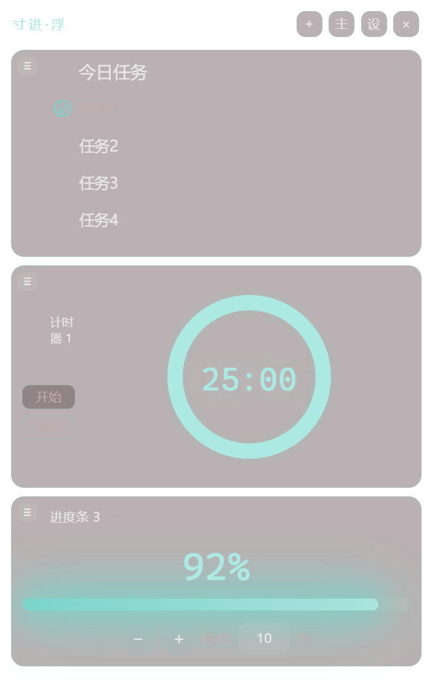
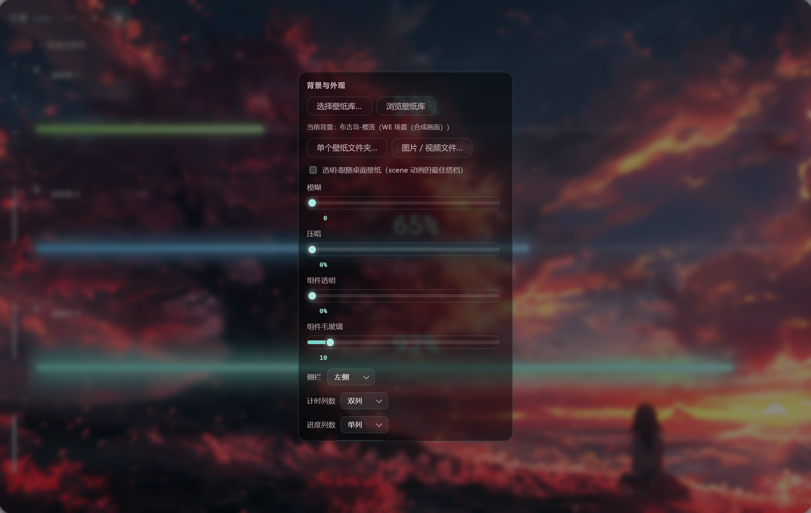

# 寸进 · cunjin

一个 Windows 桌面小工具：**计划 / 计时 / 进度**，支持桌面悬浮窗展示、壁纸联动配色。

> 系统要求：**Windows 10 / 11 64 位（x64）**
> 许可：**CC BY-NC 4.0**（署名·非商业性使用），仅供个人学习与自用。

## 功能
（软件不提供壁纸，需要自行存放至本地。）
- **计划**：今日任务 / 短期计划 / 长期目标；圆圈勾选、行内编辑、拖拽排序、文字样式（颜色/大小/粗细）独立设置。
  
- **计时**：正计时 / 倒计时多实例；倒计时可设 分 + 秒；正计时带提醒间隔（分 + 秒）；数字 / 圆环 / 沙漏形态。
  
- **进度**：进度条多实例；拖拽调进度、步长设置、颜色自定义（跟随主题色或取色器）；接近 100% 逐渐发光，100% 闪烁并弹出祝贺提示。
  
- **悬浮窗**：把计时器 / 进度条 / 今日任务组合成独立悬浮窗（置顶、可拖拽排序、−移出 / ×删除）。
  
- **壁纸联动**：选择壁纸（图片 / 视频 / 壁纸文件夹 ）→ 自动取主色调并生成颜色搭配，应用到 UI 文字、按钮、组件；带独立取色器实时预览。
  

## 下载

- **绿色版 zip**：解压即用（`cunjin-1.0.0-win-x64.zip`）
- **便携版 exe**：单文件双击运行（`cunjin-1.0.0-win-x64-portable.exe`）
- **安装器 exe**：NSIS 安装包（`cunjin-1.0.0-win-x64-setup.exe`）

三种形态均为 x64，数据默认保存在程序旁边的 `data/` 文件夹（绿色版/便携版），删除文件夹即卸载。

## 从源码运行 / 构建

```bash
npm install          # 安装依赖（你需已安装 Node.js 20+）
npm start            # 开发模式运行
npm run dist         # 构建 dist/win-unpacked
bash build.sh        # 或使用打包脚本（保留程序旁 data 数据）
```

## 目录结构

```
main.js              主进程（窗口/数据/IPC/壁纸解析）
preload.js           安全桥接
renderer/
  index.html         主界面
  widget.html        悬浮窗
  colorpicker.html   独立取色器窗口
  styles.css         样式
  js/                卡片/计划/壁纸/调色/工具等
build.sh             绿色版打包脚本
icon-design/         .ico 图标（打包用）与透明 PNG 源素材
tools/repkg/         第三方工具 RePKG（Wallpaper Engine scene 解包）
```

## 许可

[CC BY-NC 4.0](LICENSE) —— 署名 + 非商业性使用。内置 Electron / Chromium 等第三方组件按其各自许可分发。
